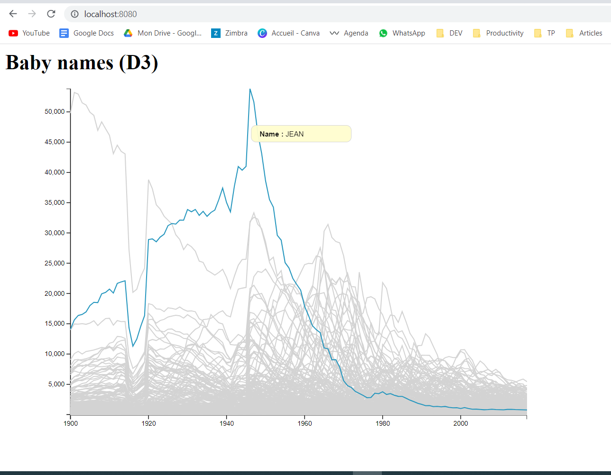
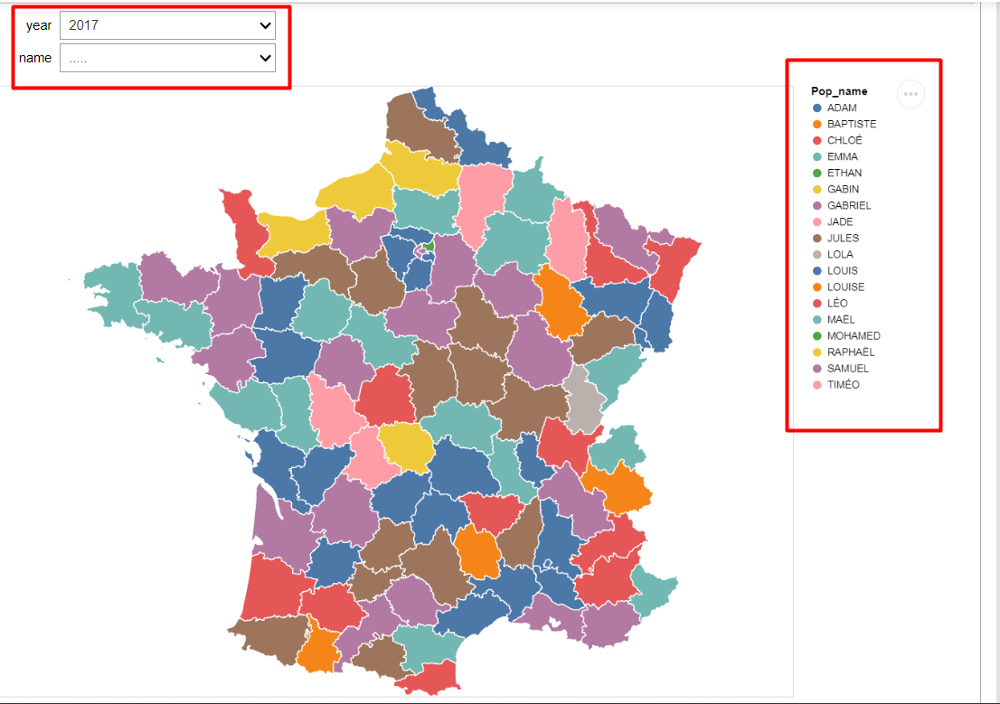
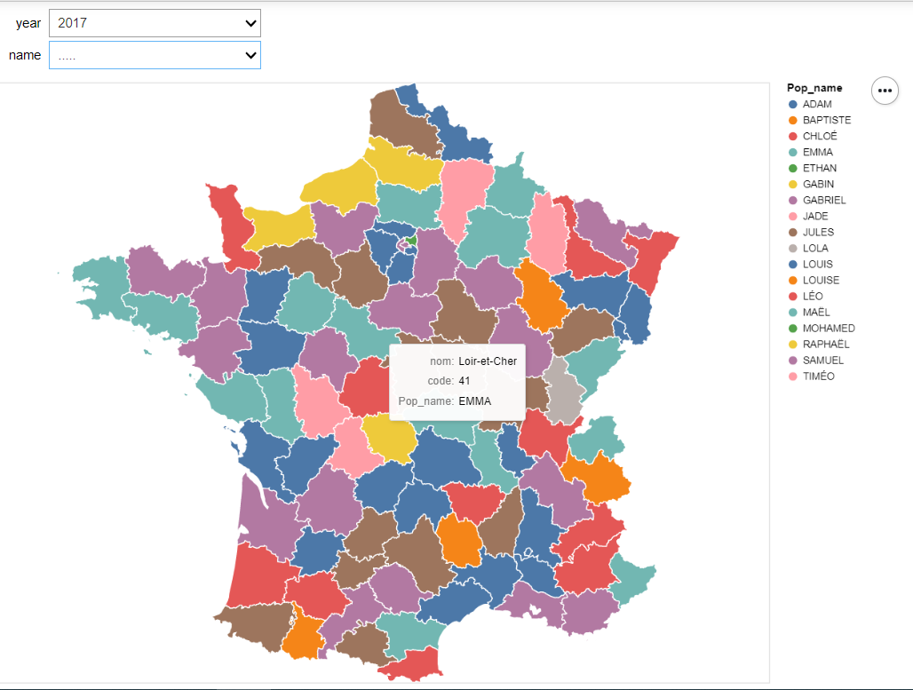
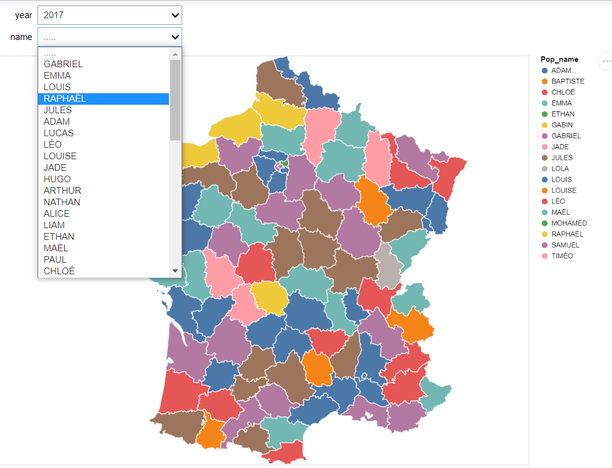
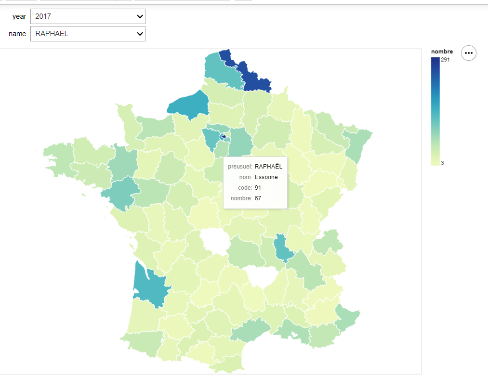
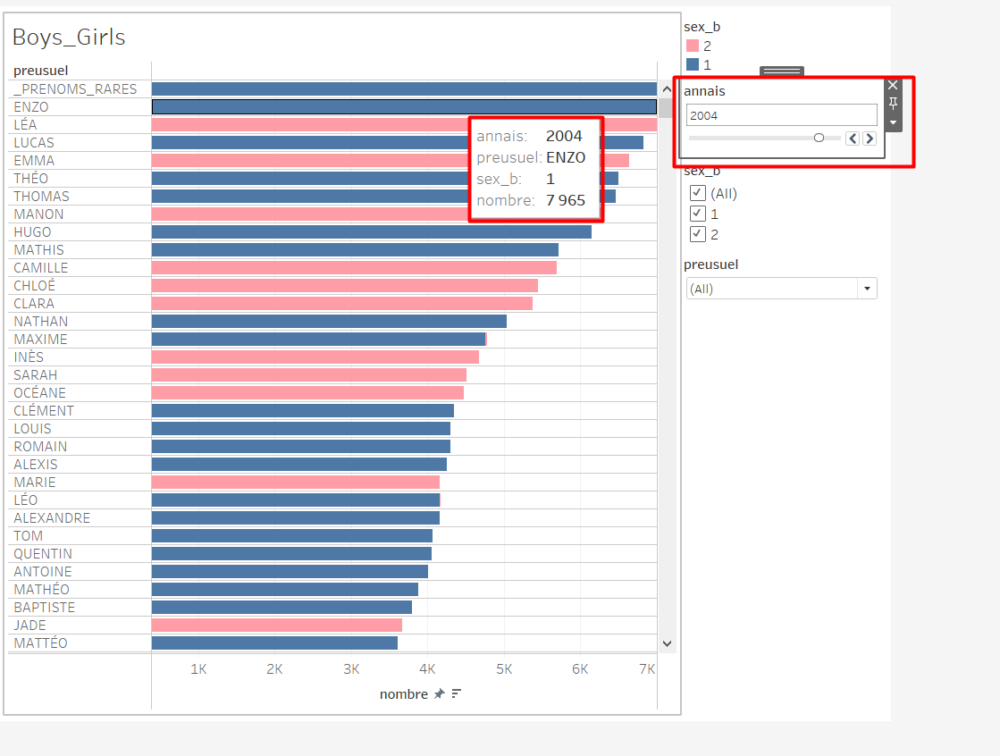

## Visualization 1 (D3) :
How do baby names evolve over time? Are there names that have consistently remained popular or unpopular? Are there some that were suddenly or briefly popular or unpopular? Are there trends in time?
#

## The second visualisation (Altair):

Is there a regional effect in the data? Are some names more popular in some regions? Are popular names generally popular across the whole country?
 
Our visualization has two types of input, a date and a name, and it offers two possibilities to visualize the data: 
The first is to choose only the year without the name, by doing this, each department in the map will be filled with the color of the popular name in that department and in the selected year (there is a legend on the right).
#

#
 If the user hovers over a department, he will be able to see more details such as the name of the department, the code and the popular name.
#

 
The second one is to choose the year and the name, with these two entries, the map will show the distribution of this name by department. As we can see in the image below, the regions with dark colors have had several births of the chosen name in the selected year.
#

#
 And also, if the user hovers over a department, he will be able to see more details like the department name, code and name, and the number of births.
 #

###Problem solved:
Since the number of names is very large, we couldn't  list all of them in the name drop-down menu, the solution we found is to 
to list only the popular names of the year chosen by the user, and each time the user changes the year, this list will be automatically modified (it will contain the 50 popular names, we chose 50 to give the reader more choice).

###Why this visualization answers the given questions:
- It allows to have an overview of the popular names during a year on the map and to see in which departments they were very present.
- If in one year some colors were very present on the map, we can easily deduce the popular names.
So we answer the following question: Are popular names generally popular throughout the country?

- Aso it allows us to see the distribution of a specific name in a year by region, and to see if certain names are more popular in some regions and not in others.
So we answer: Is there a regional effect in the data? Are certain names more popular in certain regions?

## The third visualisation (Tableau):
Are there gender effects in the data? Does popularity of names given to both sexes evolve consistently?

