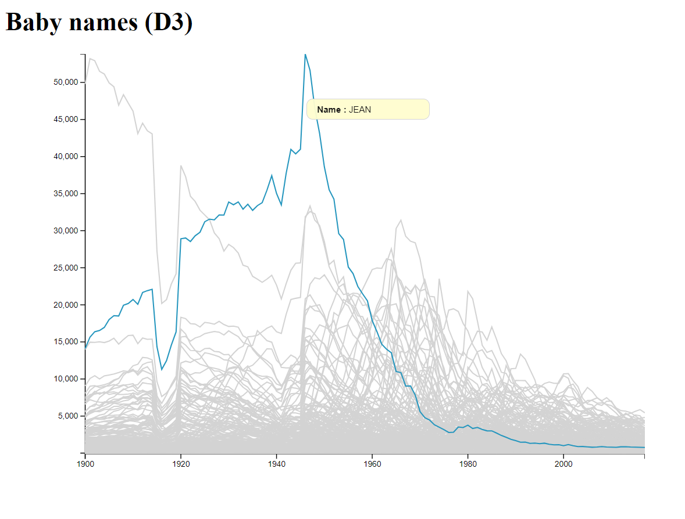

## Visualization 1 (D3) :
How do baby names evolve over time? Are there names that have consistently remained popular or unpopular? Are there some that were suddenly or briefly popular or unpopular? Are there trends in time?

## The second visualisation (Altair):
Is there a regional effect in the data? Are some names more popular in some regions? Are popular names generally popular across the whole country?

## The third visualisation (Tableau):
Are there gender effects in the data? Does popularity of names given to both sexes evolve consistently?

